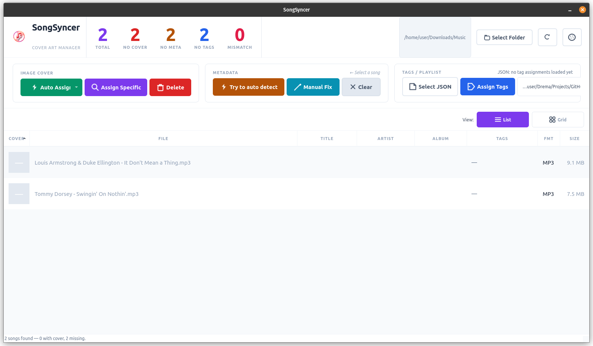
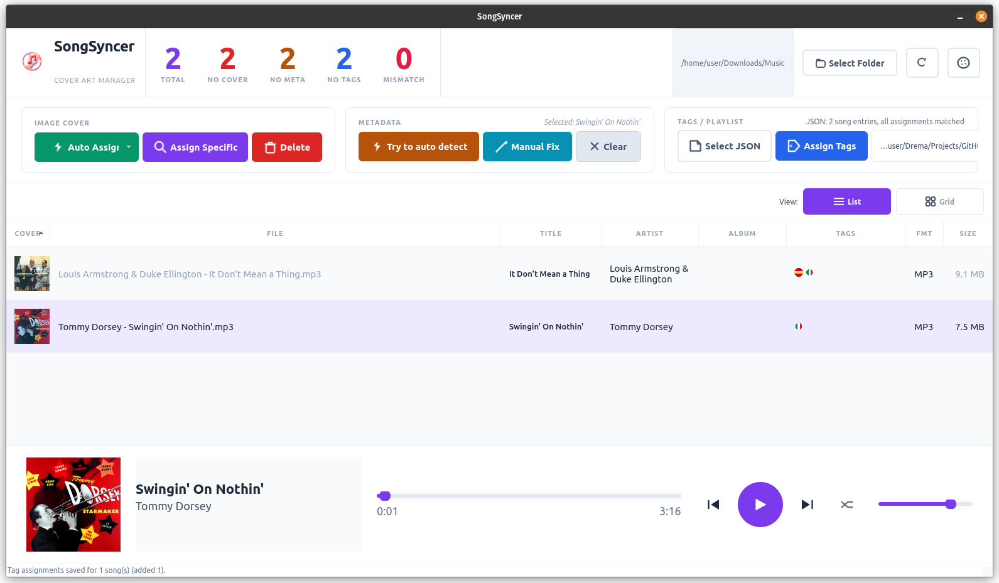

# SongSyncer

A desktop application for managing embedded cover art, metadata, and tag (Playlists) assignments in your music library. Built with PyQt5.


## Features

- **Cover Art Management** — Auto-fetch and embed cover art from iTunes, Deezer, and MusicBrainz, or manually pick from search results
- **Metadata Editing** — Parse `Artist - Title (Album)` from filenames and write ID3/Vorbis/MP4 tags, or edit manually before applying
- **Tag Assignments** — Organize songs into custom tag groups stored in a portable JSON file, with icon previews
- **Built-in Music Player** — Double-click any song to play it in a slide-up player bar with cover art, progress, and shuffle support
- **4 Themes** — Cycle through Light, Purple, Pink, and Green themes at runtime; your choice is saved automatically
- **Customizable Icons** — Point the app at a folder of PNG/SVG files to override any built-in button icon
- **List & Grid Views** — Switch between a detailed table and a visual album-cover grid
- **Batch Operations** — Auto-assign covers, fix metadata, or clear tags across your entire library or a selection
- **Responsive UI** — Button text and dialog layouts scale with window size

## Supported Formats

MP3, FLAC, M4A/AAC, OGG Vorbis, OPUS, WAV

## Screenshots



## Installation

### Windows

```bash
# Clone the repository
git clone https://github.com/<your-username>/SongSyncer.git
cd SongSyncer

# Create and activate virtual environment
py -m venv .venv
.venv\Scripts\activate

# Install dependencies in the virtual environment
python -m pip install --upgrade pip
python -m pip install -r requirements.txt

# Run
python main.py
```

No extra system packages needed — `pip install PyQt5` includes multimedia support on Windows.

### Linux (Ubuntu / Debian)

```bash
# System packages for Qt multimedia (audio playback)
sudo apt install python3-pyqt5 python3-pyqt5.qtmultimedia \
                 libqt5multimedia5-plugins gstreamer1.0-plugins-good

# Clone and install Python deps
git clone https://github.com/<your-username>/SongSyncer.git
cd SongSyncer

# Create and activate virtual environment
python3 -m venv .venv
source .venv/bin/activate

# Install dependencies in the virtual environment
python -m pip install --upgrade pip
python -m pip install -r requirements.txt

# Run
python main.py
```

### Linux (Fedora)

```bash
sudo dnf install python3-qt5 python3-qt5-multimedia gstreamer1-plugins-good
git clone https://github.com/<your-username>/SongSyncer.git
cd SongSyncer
python3 -m venv .venv
source .venv/bin/activate
python -m pip install --upgrade pip
python -m pip install -r requirements.txt
python main.py
```

### macOS

```bash
git clone https://github.com/<your-username>/SongSyncer.git
cd SongSyncer
python3 -m venv .venv
source .venv/bin/activate
python -m pip install --upgrade pip
python -m pip install -r requirements.txt
python main.py
```

> **Audio playback note:** The player tries PyQt5 QtMultimedia first, then falls back to pygame. If neither works, the app still runs — only playback is disabled.

## Usage

1. **Select a Music Folder** — Click *Select Folder* in the header to scan a directory for audio files.
2. **Manage Cover Art** — Use the **Image Cover** group:
   - *Auto Assign* (dropdown) — assign covers to selected songs or all songs missing covers
   - *Assign Specific* — search and pick from 6 candidates for a single song
   - *Delete* — remove embedded cover art from selected songs
3. **Fix Metadata** — Use the **Metadata** group:
   - *Try to auto detect* — parse `Artist - Title (Album)` from filenames
   - *Manual Fix* — preview and edit all proposed changes before applying
   - *Clear* — strip title/artist/album tags
4. **Assign Tags** — Use the **Tags / Playlist** group:
   - Select a JSON file to store assignments
   - Click *Assign Tags* to open the tag picker (scales to your window size)
5. **Play Music** — Double-click any song. The player bar slides up with cover art, progress slider, prev/next, and shuffle.
6. **Switch Theme** — Click the palette button in the header to cycle through Light, Purple, Pink, and Green.

## Customization

### Themes

Four built-in themes: **Light**, **Purple** (dark), **Pink** (dark), **Green** (dark). Your choice is persisted via `QSettings`. Colors are defined in `themes.py`; the stylesheet is generated dynamically in `style.py`.

### Custom Icons

To use your own button icons:

1. Create a folder with PNG or SVG files named after icons:
   `folder.png`, `refresh.png`, `bolt.png`, `search.png`, `trash.png`, `wand.png`, `pencil.png`, `x_mark.png`, `document.png`, `tag.png`, `list.png`, `grid.png`, `play.png`, `pause.png`, `skip_back.png`, `skip_forward.png`, `volume.png`, `shuffle.png`, `image.png`, `text.png`, `music_note.png`, `palette.png`

2. Set the custom icon directory in the app settings. The app checks this directory before falling back to built-in QPainter-drawn icons.

### Tag Icons

Tag category icons live in `Data/Tags/`. The **icon filename stem is the canonical tag identifier** — the string stored in the JSON. The GUI converts underscores to spaces and title-cases each word for display.

- File: `Data/Tags/fairy_tail.png` → JSON tag: `"fairy_tail"` → shown as `Fairy Tail`
- File: `Data/Tags/neon_genesis_evangelion.png` → JSON tag: `"neon_genesis_evangelion"` → shown as `Neon Genesis Evangelion`

To add a new tag, just drop a `<name>.png` into `Data/Tags/` — no config required.

Acronyms can be force-capitalised by editing `_DISPLAY_OVERRIDES` in `tags_list.py` (e.g., `ita` → `ITA`).

### Window Icon

Place an `icon.png` in the project root to set the window/taskbar icon.

## Project Structure

```
SongSyncer/
├── main.py              # Application entry point and main window
├── tags_list.py         # Scans Data/Tags/ — icon stem is the canonical tag id
├── style.py             # Stylesheet generator (theme-aware)
├── themes.py            # Light, Purple, Pink, Green color palettes
├── icons.py             # QPainter-drawn vector icons (no external files needed)
├── player.py            # Slide-up music player bar (QtMultimedia / pygame)
├── cover_art.py         # Read/write/delete embedded cover art
├── search.py            # Cover art search (iTunes, Deezer, MusicBrainz)
├── workers.py           # Background QThread workers (scan, thumbnails, auto-assign)
├── dialogs.py           # Image picker, progress, metadata review, tag assignment
├── playlist_store.py    # JSON-based song ↔ tag assignment storage
├── icon.png             # Application icon
├── requirements.txt     # Python dependencies
├── Data/
│   └── Tags/            # Tag category icon PNGs (filename stem = tag identifier)
└── README.md
```

## Dependencies

| Package | Purpose |
|---------|---------|
| PyQt5 >= 5.15 | GUI framework |
| mutagen >= 1.47 | Audio metadata read/write |
| requests >= 2.28 | Cover art search API calls |
| Pillow >= 9.0 | Image processing |
| pygame >= 2.0 | Fallback audio backend (optional but recommended) |

## Troubleshooting

| Problem | Solution |
|---------|----------|
| No audio playback | Install `python3-pyqt5.qtmultimedia` (Linux) or ensure `pygame` is installed |
| Song doesn't play on click | Check terminal for `[PlayerBar] media error:` messages. Try installing GStreamer plugins (Linux) |
| Import error for QtMultimedia | `pip install PyQt5` on Windows/macOS; use system packages on Linux |
| Wayland startup crash (`QSocketNotifier`, `Wayland connection broke`) | Run with `SONGSYNCER_QT_PLATFORM=wayland python main.py` to force Wayland, or keep the default `xcb` fallback in Wayland sessions |
| Tags not saving | Ensure the tag JSON file path is writable |
| Cover art not found | The song needs at least a title or filename with `Artist - Title` format |

## Contributing

1. Fork the repository
2. Create a feature branch (`git checkout -b feature/my-feature`)
3. Commit your changes
4. Push to the branch (`git push origin feature/my-feature`)
5. Open a Pull Request

## License

MIT
