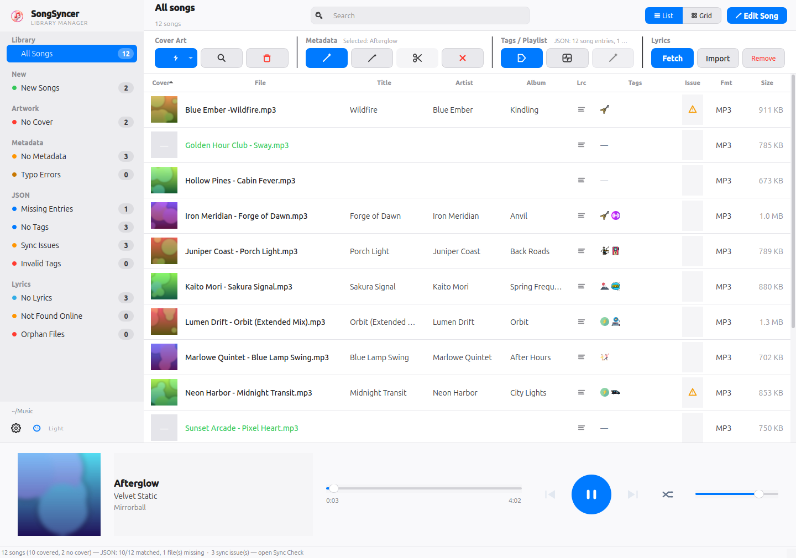
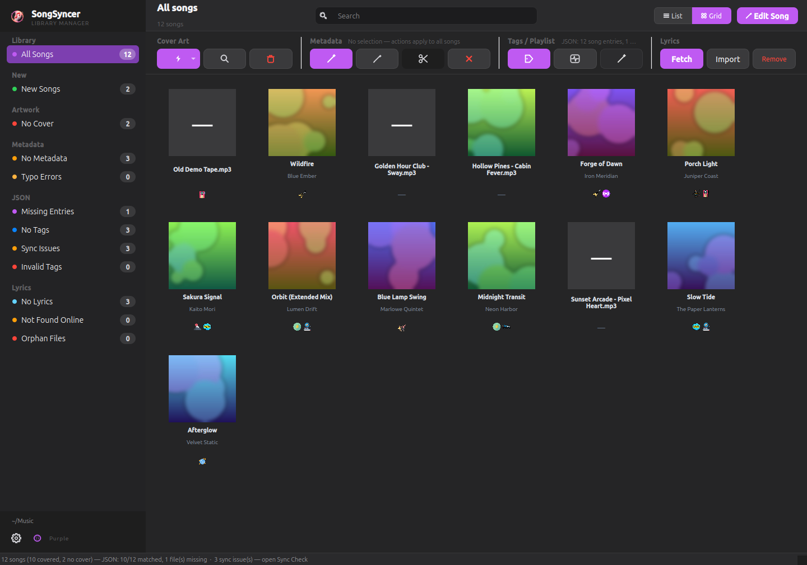
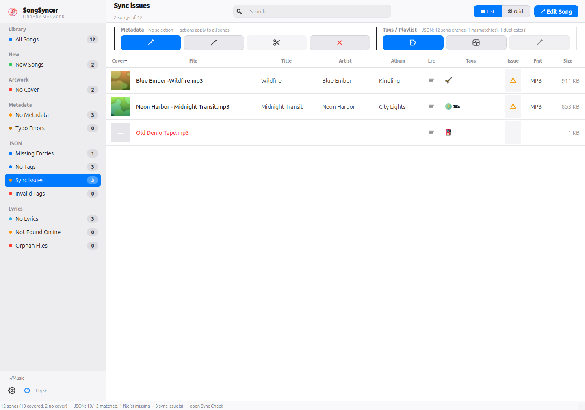
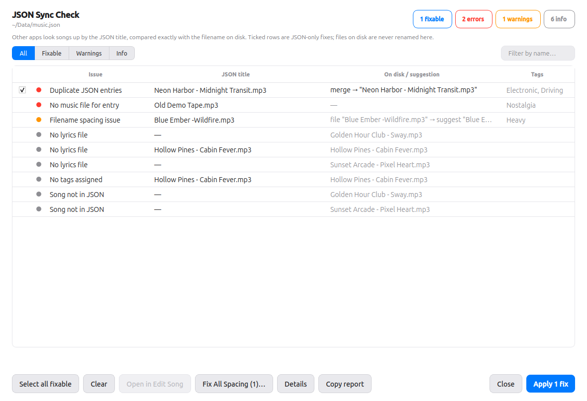
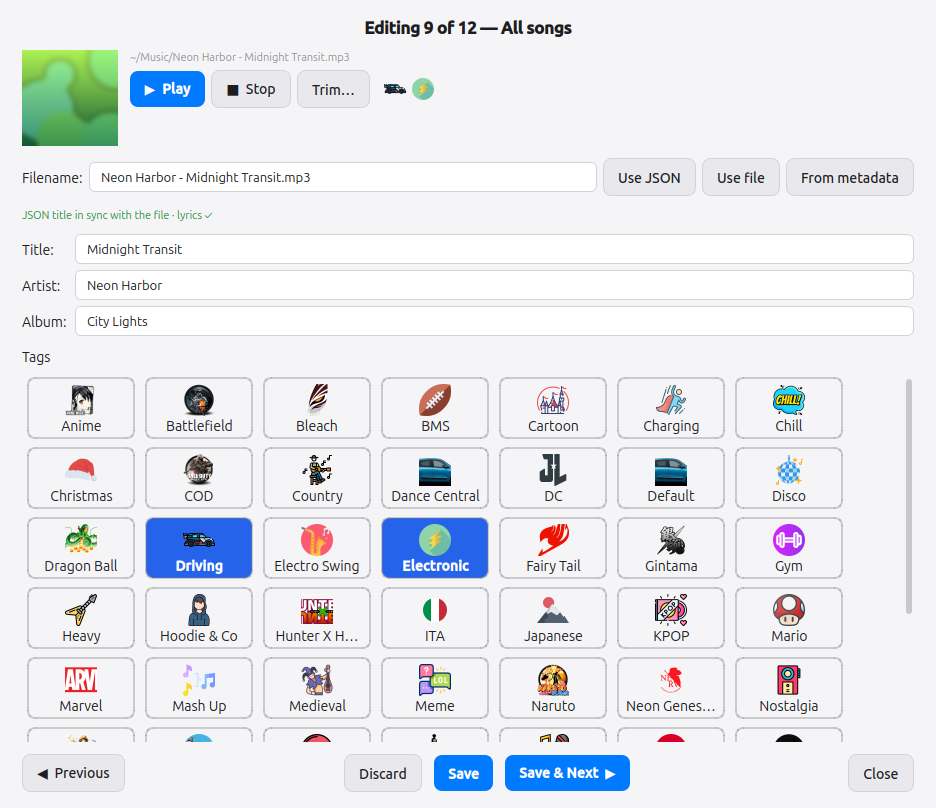
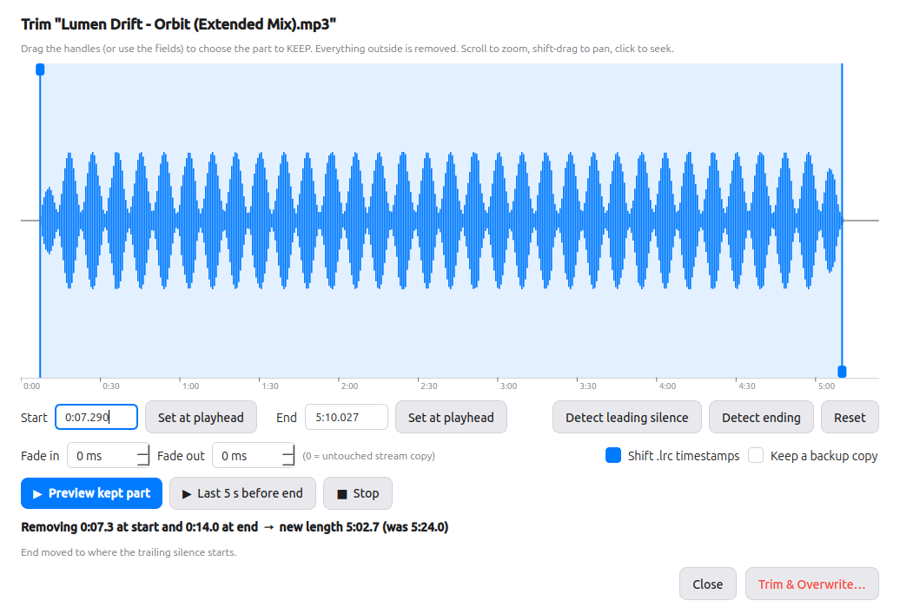

# SongSyncer

A desktop application for managing embedded cover art, metadata, lyrics and tag (playlist) assignments in your music library — and for keeping the tag JSON **strictly in sync** with the files on disk. Built with PyQt5, macOS-style sidebar layout.


## Features

- **Cover Art Management** — Auto-fetch and embed cover art from iTunes, Deezer, and MusicBrainz, or manually pick from search results
- **Metadata Editing** — Parse `Artist - Title (Album)` from filenames and write ID3/Vorbis/MP4 tags, or edit manually before applying
- **Tag Assignments** — Organize songs into custom tag groups stored in a portable JSON file, with icon previews
- **New Songs** — Files just added to your library (no JSON entry, no cover, no metadata — i.e. never touched by this app) get their own sidebar section and a green filename in the list, so freshly-dropped-in files are obvious without digging through JSON diagnostics. Deliberately separate from *Sync Check*: a song that already has a cover/metadata but lost its JSON entry shows up there instead, not here
- **Sync Check** — One reviewable list of every discrepancy between the JSON, the music folder and the lyrics folder: case/spacing drift (`AC dc` vs `AC DC`, `Artist -Song` vs `Artist - Song`), duplicate entries, entries without a file, files with spacing errors, lyrics files whose name differs. JSON fixes are applied in one click; files on disk are never renamed automatically. When there are filename spacing errors, **Fix All Spacing…** opens a before/after recap of every rename with its own checkbox — review (and deselect any you don't want), then apply the rest in one batch; a fix that would collide with an existing file, or with another row's own fix, is flagged and skipped automatically
- **Automatic lyrics** — Missing `.lrc` files are downloaded in the background after every scan from **LRCLIB → NetEase → lyrics.ovh** (4 parallel, rate-limited, smart title/artist cleanup), and the download keeps going when you change the music or lyrics folder. Songs no source knows are remembered as **Not Found Online** across sessions (sidebar row + orange marker in the list) so they are never re-queried until you retry them explicitly
- **Trimmer** — Cut leading/trailing silence or an unexpected ending with a waveform editor, silence detection, preview, optional fades and `.lrc` timestamp shifting. The original file is overwritten in place after two confirmations
- **Built-in Music Player** — Double-click any song to play it in a slide-up player bar with cover art, progress, and shuffle support
- **4 Themes** — macOS Light plus three macOS Dark accent variants (Purple, Pink, Green); your choice is saved automatically
- **Scales with your screen** — sidebar, buttons and type grow with the display (1.0× on a 1440×900 work area, up to 1.75×); action groups fall back to text-only, then icon-only buttons when a window gets narrow
- **Customizable Icons** — Point the app at a folder of PNG/SVG files to override any built-in button icon
- **List & Grid Views** — Switch between a detailed table and a visual album-cover grid
- **Batch Operations** — Auto-assign covers, fix metadata, or clear tags across your entire library or a selection
- **Responsive UI** — Button text and dialog layouts scale with window size

## Supported Formats

MP3, FLAC, M4A/AAC, OGG Vorbis, OPUS, WAV

## Screenshots

> Screenshots use a fictional demo library — song names, artists and cover art are made up.



| Grid view (Purple theme) | Sidebar filter — Sync Issues |
|---|---|
|  |  |

| Sync Check | Edit Song |
|---|---|
|  |  |



## Installation

### Windows

```bash
# Clone the repository
git clone https://github.com/GiniroiSenkou/9549_SongSyncer.git SongSyncer
cd SongSyncer

# Create and activate virtual environment
py -m venv .venv
.venv\Scripts\activate

# Install dependencies in the virtual environment
python -m pip install --upgrade pip
python -m pip install -r requirements.txt

# Run
python main.py
```

No extra system packages needed — `pip install PyQt5` includes multimedia support on Windows. For the Trimmer, install [ffmpeg](https://ffmpeg.org/download.html) and make sure `ffmpeg`/`ffprobe` are on `PATH`.

### Linux (Ubuntu / Debian)

```bash
# System packages for Qt multimedia (audio playback) + ffmpeg (Trimmer)
sudo apt install python3-pyqt5 python3-pyqt5.qtmultimedia \
                 libqt5multimedia5-plugins gstreamer1.0-plugins-good ffmpeg

# Clone and install Python deps
git clone https://github.com/GiniroiSenkou/9549_SongSyncer.git SongSyncer
cd SongSyncer

# Create and activate virtual environment
python3 -m venv .venv
source .venv/bin/activate

# Install dependencies in the virtual environment
python -m pip install --upgrade pip
python -m pip install -r requirements.txt

# Run
python main.py
```

### Linux (Fedora)

```bash
sudo dnf install python3-qt5 python3-qt5-multimedia gstreamer1-plugins-good ffmpeg
git clone https://github.com/GiniroiSenkou/9549_SongSyncer.git SongSyncer
cd SongSyncer
python3 -m venv .venv
source .venv/bin/activate
python -m pip install --upgrade pip
python -m pip install -r requirements.txt
python main.py
```

### macOS

```bash
git clone https://github.com/GiniroiSenkou/9549_SongSyncer.git SongSyncer
cd SongSyncer
python3 -m venv .venv
source .venv/bin/activate
python -m pip install --upgrade pip
python -m pip install -r requirements.txt
python main.py
```

> **Audio playback note:** The player tries PyQt5 QtMultimedia first, then falls back to pygame. If neither works, the app still runs — only playback is disabled.

## The JSON contract

Other tools (e.g. a player or a playlist builder) read `music.json` and look every song up by its `title`, compared **exactly** with the filename on disk:

```json
{ "version": 2, "songs": [ { "title": "AC DC - Thunderstruck.mp3", "tags": ["heavy"] } ] }
```

So `title` must be the on-disk filename, extension included, byte for byte. SongSyncer's matcher is deliberately lenient when *finding* an entry (case-folded, Unicode-normalised, spacing-normalised) so that a drifted entry is still recognised — but it never silently keeps the stale spelling. Every drift is listed in **Sync Check** and rewritten to the exact disk name when you apply the fixes. Entries are always *updated in place*: a fix never appends a second entry or leaves a clone behind, and duplicates are merged (tags unioned).

## Usage

1. **Select a Music Folder** — Open *Settings* (gear, bottom of the sidebar) and pick the Music folder, the tag JSON and the Lyrics folder.
2. **Manage Cover Art** — Use the **Image Cover** group:
   - *Auto Assign* (dropdown) — assign covers to selected songs or all songs missing covers
   - *Assign Specific* — search and pick from 6 candidates for a single song
   - *Delete* — remove embedded cover art from selected songs
3. **Fix Metadata** — Use the **Metadata** group:
   - *Try to auto detect* — parse `Artist - Title (Album)` from filenames
   - *Manual Fix* — preview and edit all proposed changes before applying
   - *Clear* — strip title/artist/album tags
4. **Assign Tags** — Use the **Tags / Playlist** group:
   - Click *Assign Tags* to open the tag picker
   - Click *Sync Check* to review and fix JSON drift, duplicates and missing entries (see *The JSON contract*)
   - *Fix Tags* remaps tag names that don't match an icon in `Data/Tags/`
5. **Lyrics** — With a lyrics folder set and *Download missing lyrics automatically* enabled (Settings), `.lrc` files are fetched in the background after each scan (LRCLIB, then NetEase, then lyrics.ovh); the sidebar shows the progress. Songs no source had are listed under **Not Found Online** and marked orange in the *Lrc* column (hover for the date and sources) — this list is saved in `<lyrics folder>/.lrc_misses.json` so they aren't asked again. To retry, select them and press *Fetch*; *Import* copies an `.lrc` under the canonical name.
6. **Edit Song** — Focused editor for one song at a time (filename, metadata, tags). The hint under the filename tells you whether the JSON title is in sync and offers a corrected spelling for spacing errors; *From metadata* proposes `Artist - Title.ext`. Saving renames the file, its `.lrc` and the JSON entry together, the list row updates immediately, and a green **✓ Saved** confirmation shows what was written.
7. **Trim** — Select one song and click *Trim* (Metadata group) or *Trim…* in Edit Song. Drag the handles or use *Detect leading silence* / *Detect ending*, preview, then *Trim & Overwrite…* — you confirm twice because the original file is replaced.
8. **Play Music** — Double-click any song. The player bar slides up with cover art, progress slider, prev/next, and shuffle.
9. **Switch Theme** — Click the palette button at the bottom of the sidebar to cycle through Light, Purple, Pink, and Green.
10. **Sidebar filters** — Every counter in the sidebar is a filter (New Songs, No Cover, No Metadata, Typo Errors, Missing Entries, No Tags, Sync Issues, Invalid Tags, No Lyrics). Click again to clear.

## Customization

### Themes

Four built-in themes: **Light** (macOS Light, blue accent), **Purple**, **Pink** and **Green** (macOS Dark with the matching accent). Your choice is persisted via `QSettings`. Colors are defined in `themes.py`; the stylesheet is generated dynamically in `style.py`.

### Custom Icons

To use your own button icons:

1. Create a folder with PNG or SVG files named after icons:
   `folder.png`, `refresh.png`, `bolt.png`, `search.png`, `trash.png`, `wand.png`, `pencil.png`, `x_mark.png`, `document.png`, `tag.png`, `list.png`, `grid.png`, `play.png`, `pause.png`, `skip_back.png`, `skip_forward.png`, `volume.png`, `shuffle.png`, `image.png`, `text.png`, `music_note.png`, `palette.png`

2. Set the custom icon directory in the app settings. The app checks this directory before falling back to built-in QPainter-drawn icons.

### Tag Icons

Tag category icons live in `Data/Tags/`. The **icon filename stem is the canonical tag identifier** — the string stored in the JSON. The GUI converts underscores to spaces and title-cases each word for display.

- File: `Data/Tags/fairy_tail.png` → JSON tag: `"fairy_tail"` → shown as `Fairy Tail`
- File: `Data/Tags/neon_genesis_evangelion.png` → JSON tag: `"neon_genesis_evangelion"` → shown as `Neon Genesis Evangelion`

To add a new tag, just drop a `<name>.png` into `Data/Tags/` — no config required.

Acronyms can be force-capitalised by editing `_DISPLAY_OVERRIDES` in `tags_list.py` (e.g., `ita` → `ITA`).

### Window Icon

Place an `icon.png` in the project root to set the window/taskbar icon.

## Project Structure

```
SongSyncer/
├── main.py              # Application entry point and main window (sidebar + toolbar layout)
├── json_health.py       # Strict JSON↔disk↔lyrics audit, name rules, one-click fixes
├── audio_trim.py        # ffmpeg-backed trimming, waveform peaks, silence detection
├── lyrics_store.py      # .lrc pairing, LRCLIB miss cache, timestamp shifting
├── lyrics_fetcher.py    # Lyrics clients: LRCLIB, NetEase, lyrics.ovh
├── tags_list.py         # Scans Data/Tags/ — icon stem is the canonical tag id
├── style.py             # Stylesheet generator (theme-aware)
├── themes.py            # Light, Purple, Pink, Green color palettes
├── icons.py             # QPainter-drawn vector icons (no external files needed)
├── player.py            # Slide-up music player bar (QtMultimedia / pygame)
├── cover_art.py         # Read/write/delete embedded cover art
├── search.py            # Cover art search (iTunes, Deezer, MusicBrainz)
├── workers.py           # Background QThread workers (scan, thumbnails, auto-assign, parallel lyrics, trim)
├── dialogs.py           # Image picker, Sync Check, Edit Song, Trimmer, settings, tag assignment
├── playlist_store.py    # JSON-based song ↔ tag assignment storage (loose matching, duplicate reporting)
├── image_utils.py       # Cover/icon decoding and cropping helpers
├── icon.png             # Application icon
├── requirements.txt     # Python dependencies
├── Data/
│   └── Tags/            # Tag category icon PNGs (filename stem = tag identifier)
├── examples/
│   └── music.json       # Sample tag JSON
├── tests/               # unittest suite + offscreen GUI harness
├── Screenshots/         # README images
├── CHANGELOG.md
└── README.md
```

## Dependencies

| Package | Purpose |
|---------|---------|
| PyQt5 >= 5.15 | GUI framework |
| mutagen >= 1.47 | Audio metadata read/write |
| requests >= 2.28 | Cover art search API calls |
| Pillow >= 9.0 | Image processing |
| pygame >= 2.0 | Fallback audio backend (optional but recommended) |
| ffmpeg / ffprobe (system) | Trimmer: waveform analysis and cutting (optional; WAV works without it) |

## Troubleshooting

| Problem | Solution |
|---------|----------|
| No audio playback | Install `python3-pyqt5.qtmultimedia` (Linux) or ensure `pygame` is installed |
| Song doesn't play on click | Check terminal for `[PlayerBar] media error:` messages. Try installing GStreamer plugins (Linux) |
| Import error for QtMultimedia | `pip install PyQt5` on Windows/macOS; use system packages on Linux |
| Wayland startup crash (`QSocketNotifier`, `Wayland connection broke`) | Run with `SONGSYNCER_QT_PLATFORM=wayland python main.py` to force Wayland, or keep the default `xcb` fallback in Wayland sessions |
| Tags not saving | Ensure the tag JSON file path is writable |
| Another app can't find a song that SongSyncer shows as matched | Open *Sync Check* — the JSON title differs from the filename (case/spacing); apply the fixes |
| Trim button says ffmpeg not found | Install ffmpeg (see Installation); WAV files still work without it |
| Cover art not found | The song needs at least a title or filename with `Artist - Title` format |

## Tests

```bash
python -m unittest                            # whole suite
QT_QPA_PLATFORM=offscreen python -m unittest  # headless (CI / SSH)
```

The GUI tests boot the real main window against a throw-away fixture library with isolated `QSettings` (see `tests/offscreen_harness.py`), so they never touch your own music, lyrics or JSON settings. The Trimmer tests need `ffmpeg`.

See [CHANGELOG.md](CHANGELOG.md) for recent fixes.

## Contributing

1. Fork the repository
2. Create a feature branch (`git checkout -b feature/my-feature`)
3. Commit your changes
4. Push to the branch (`git push origin feature/my-feature`)
5. Open a Pull Request

## License

MIT
